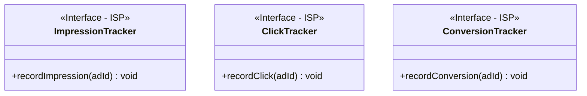
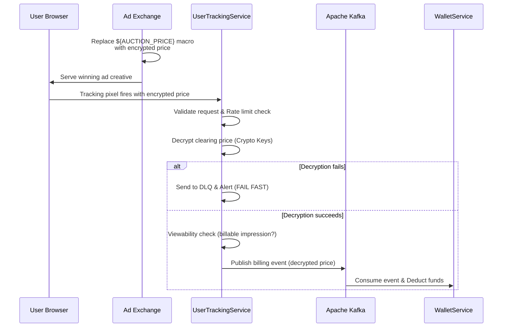
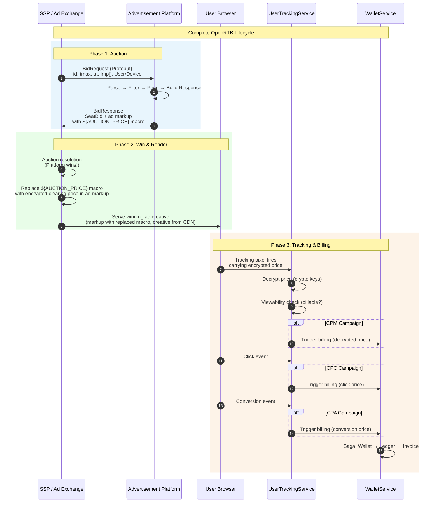

# User Event & Analytics Tracking Service (UserTrackingService)

## Overview
The `UserTrackingService` (formerly Event Tracking Service) handles high-throughput ingestion of advertising interaction events (impressions, clicks, video completions, and conversions). It is responsible for attributing events, decrypting real-time auction clearing prices, and safely forwarding validated billing events to the financial systems.

## Core Responsibilities
- **High-Throughput Ingestion**: Ingests tracking pixels and events from client browsers and native SDKs.
- **Event Buffering**: Utilizes LMAX Disruptor for lock-free processing and Apache Kafka for durable, asynchronous buffering.
- **OLAP Analytics**: Feeds data into ClickHouse for high-throughput, real-time reporting dashboards.
- **Conversion Attribution**: Implements configurable lookback windows (e.g., 30-day click-through, 1-day view-through) for accurate ad attribution.

## Interface Segregation (ISP)
The system strictly adheres to the Interface Segregation Principle. Rather than forcing all analytical components to implement a massive `AdServerTracker` interface, the platform utilizes segregated, single-method interfaces:

This prevents unrelated microservices—such as a module that only processes clicks—from being burdened with heavy dependencies and unused methods related to impression viewability metrics.

## Win Notification & Decryption Flow
The service is the crucial bridge between a won auction and an actual financial deduction. 

When the `BiddingEngine` submits a bid, it embeds an `${AUCTION_PRICE}` macro into the tracking pixel URL. When the ad is rendered by the exchange, this macro is replaced by an **encrypted clearing price**.

1. Tracking pixel fires back to `UserTrackingService` carrying the encrypted price.
2. The service uses agreed-upon cryptographic keys to decrypt the precise clearing price.
3. It performs a viewability check to ensure the impression is billable.
4. It forwards the exact, decrypted amount via Kafka to the `WalletService` for deduction.

## Complete OpenRTB Lifecycle

## Resilience & Edge Cases
- **Financial Integrity**: If the `${AUCTION_PRICE}` decryption fails due to a key rotation mismatch or corrupted payload, the system **FAILS FAST**. It sends the event to a DLQ and does **NOT** process any deductions. No default values are ever used.
- **Duplicate Events**: Implements exactly-once processing semantics and idempotency keys to handle duplicate tracking events.
- **Ad Fraud & Bot Traffic**: Implements IP-based rate limiting, anomaly detection, and signature-based filtering to drop fraudulent clicks before billing.
- **Privacy Compliance (GDPR/CCPA)**: Parses IAB TCF consent strings. If consent is denied, it drops the event or strips all PII (IP, Device ID) before writing to Kafka/ClickHouse. (Note: The clearing price is financial data, not PII, so billing still proceeds securely).
- **Late-Arriving Events**: Implements watermarking and time-windowing logic in the ClickHouse pipeline for delayed mobile clicks.
- **Win Notification Distinction**: Accurately differentiates between bid-submitted tracking vs. auction-won execution by relying exclusively on the exchange's macro replacement payload.

## Ecosystem Integration Points
How this service integrates with the broader Food Delivery platform:

- **FoodDeliveryAppUI (Frontend)**: The UI renders promoted restaurant cards with a "Sponsored" badge. It interacts directly with `UserTrackingService` by firing a tracking pixel (via Intersection Observer for viewability) when the ad renders, and intercepts clicks to fire tracking events before navigating to the restaurant page.
- **WalletService**: Publishes sanitized, decrypted billing events to `TOPIC_AD_BILLING_EVENTS` for `WalletService` to consume and initiate the financial Saga.
